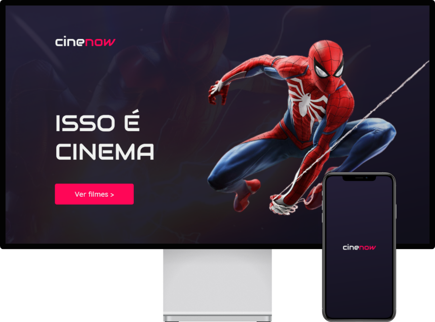

<h1 align="center">
	
</h1>

 <p  align="center">
<a  href="#"  target="_blank"  rel="noopener noreferrer"></a>
</p>

<h1 align="center">

</h1>

## 👨🏻‍💻 "In the dark of the cinema..."

Project developed for educational purposes, intentionally developed to bring the best programming practices to the course and show our evolution in the year.

### 📋 About

This project is just a cinema software with purchase of tickets and list of employees and tickets.

### 🚀 Tech

- JavaFX ☕
- Maven 🗄️
- SQLite 🪶
- Openpdf 📃
- Zxing 🦖

### 📐 Architecture

MVC or Model View Controller

- MVC is nothing more than a software architecture standard, separating your application into 3 layers. The user interaction layer (*View*), the data manipulation layer (*Model*) and the control layer (*Controller*)

### 📥 Download

```bash
  git clone https://github.com/Luiz-Ossinho/cinema.git

  Start your application to be able to download libraries through Maven
```

### ✅ Created pages

- [x] Initial page
- [x] SignIn
- [x] Dashboard
- [x] Enployee form
- [x] Section form
- [x] Movie form
- [x] Room form
- [x] Ticket authorization
- [x] Section list
- [x] Selected section


®️ IFS - Federal Institute of Sergipe - 2021

Made with ❤️ &nbsp;by [Marcos Vinicius](https://github.com/marcosl493), &nbsp;[Luiz Eduardo](https://github.com/Luiz-Ossinho), &nbsp;[Adeilton Rodrigues](https://github.com/Adeilton-Ro) & &nbsp;[Guilherme Santos](https://github.com/GuilhermeSantosUI/)
